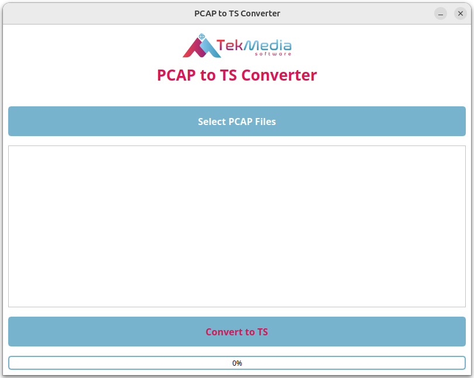
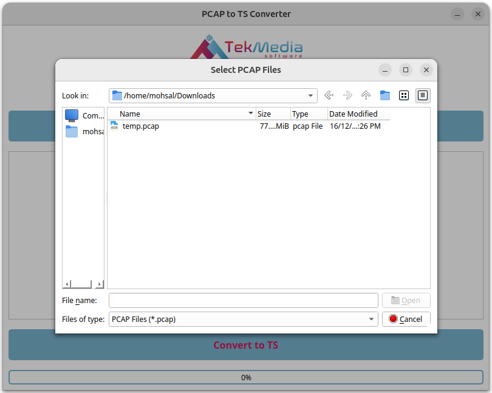
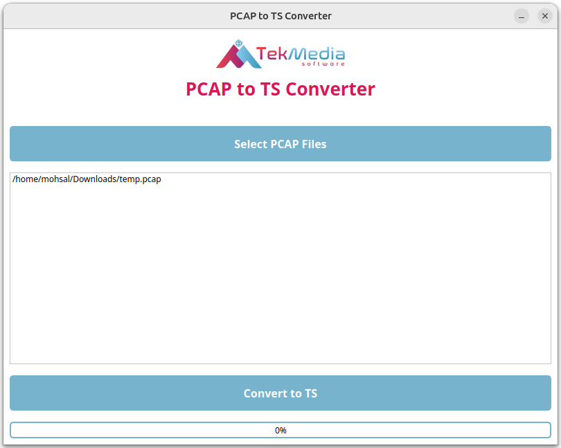
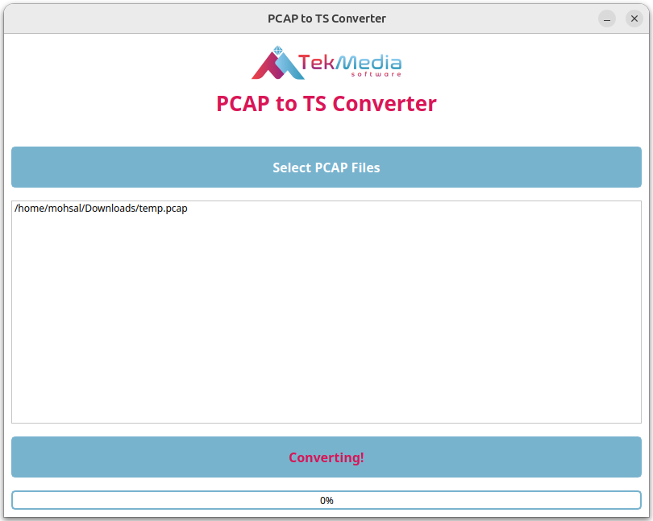
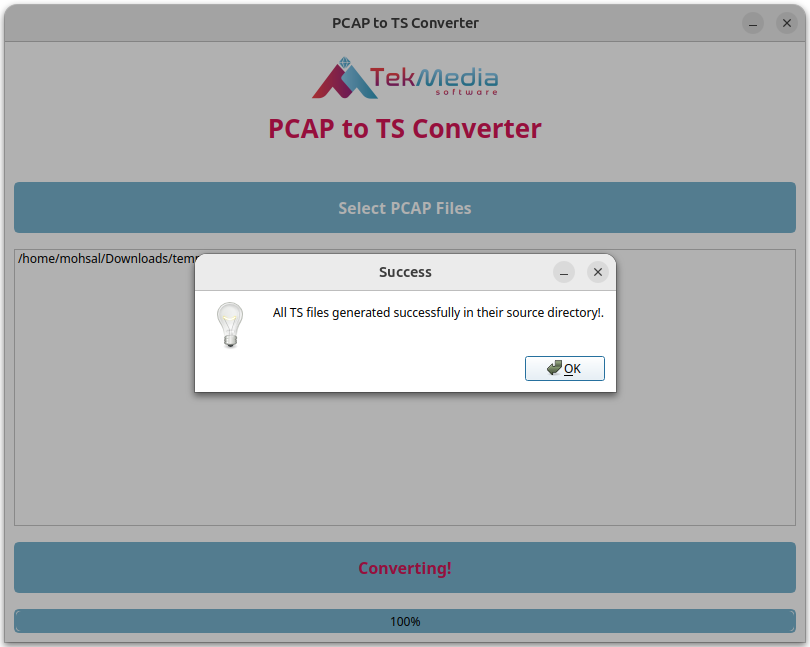

# PCAP to TS Converter

A simple GUI application for converting PCAP files to TS (Transport Stream) files using the ts duck tool. This project allows users to easily select multiple PCAP files and convert them to TS format through an intuitive PyQt5-based interface.

## Table of Contents

1. [Introduction](#introduction)
2. [Features](#features)
3. [Installation](#installation)
4. [Usage](#usage)
5. [Screenshots](#screenshots)
5. [Contact](#contact)
6. [Contributing](#contributing)
7. [License](#license)

## Introduction

This project provides a PCAP to TS converter that allows users to quickly convert PCAP files (packet capture files) to Transport Stream (TS) files, which are commonly used in video streaming applications. The converter uses the tsp tool to perform the conversion and features a PyQt5-based graphical user interface (GUI) to make the process user-friendly.

## Features

- Convert multiple PCAP files to TS format at once.
- Progress bar to show the conversion status.
- Error handling with informative messages.
- File selection dialog to choose PCAP files conveniently.
- Cross-platform support (Linux, macOS, Windows) with proper installation of dependencies.

## Installation

### Prerequisites

Before you begin, ensure you have met the following requirements:

- Python: Ensure you have Python installed (preferably Python 3.x) - (https://www.python.org/downloads/)
- PyQt5: This is the framework we'll use to build the GUI.
- TSDuck (TSTool): TSDuck is a set of tools for handling MPEG transport streams, and we use it to convert PCAP files into TS format. Since TSDuck is not a Python package, it needs to be installed separately. (https://tsduck.io/download/tsduck/)

### Steps

1. **Clone the repository**:
```
git clone https://github.com/TekMedia-Software/PCAP-to-TS-Converter.git
```

2. **Navigate to the project directory**:
```
cd PCAP-to-TS-Converter
```

3. **Install dependencies**:

For Linux (Ubuntu/Debian):
    
- Installing Python:
```
sudo apt install python3.1
```
	
- Installing PyQt:
```
pip install PyQt5
```
    
- Installing TSDuck:
  - Go to the official TSDuck download page: [TS Duck](https://tsduck.io/download/tsduck/)
  - Here, you'll find the installation packages for different operating systems, including Linux, macOS, and Windows.
  - Install the 'Binaries for command-line tools and plugins' package. For Linux download the .deb package from the website.
```
sudo dpkg -i 'tsduck*.deb'
```
    
## Usage

After installation, you can run the project using the following command:
```
python3 app.py
```

This will launch the PyQt5 GUI, where you can:

- Select one or more .pcap files to convert.
- Click the "Convert to TS" button to initiate the conversion.
- Monitor the conversion progress through the progress bar.

**Example**

- Step 1: Click the "Select PCAP Files" button to choose the .pcap files.
- Step 2: Click the "Convert to TS" button to start the conversion process.
- Step 3: Wait until the progress bar reaches 100%, indicating the conversion is complete.

## Screenshots










        
## Contact 

For any questions or feedback, please reach out:

- Awadh Bajpai - [awabaj@tekmediasoft.net](mailto:awabaj@tekmediasoft.net)
- Sushanthika Manikandan - [susman@tekmediasoft.net](mailto:susman@tekmediasoft.net)

## Contributing

We welcome contributions! Please see the [CONTRIBUTING.md](CONTRIBUTING.md) file for detailed guidelines on how to contribute to this project.

## License

This project is licensed under a proprietary license. All rights reserved. You may modify and use this software for personal purposes, but for any production use, reproduction, modification, or distribution, prior written permission from [**TekMedia Software Services**](https://tekmediasoft.com) is required.


